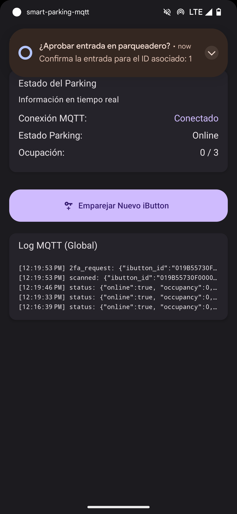
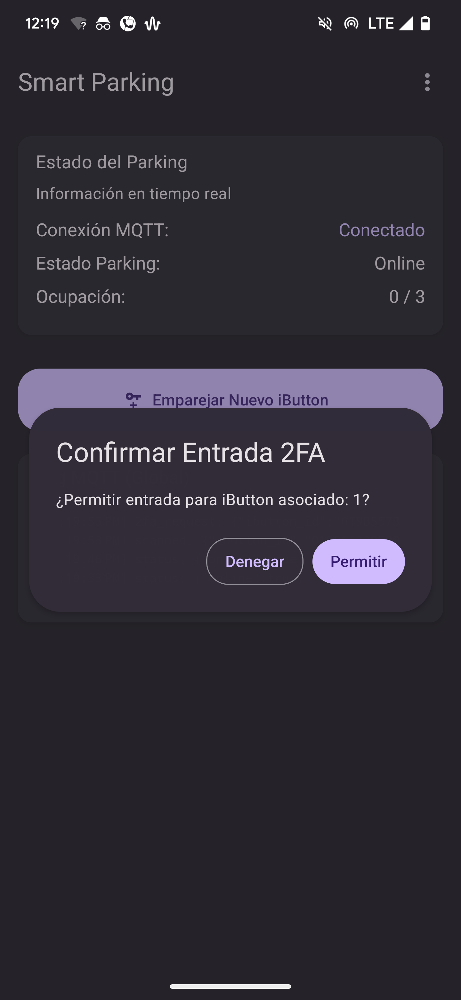
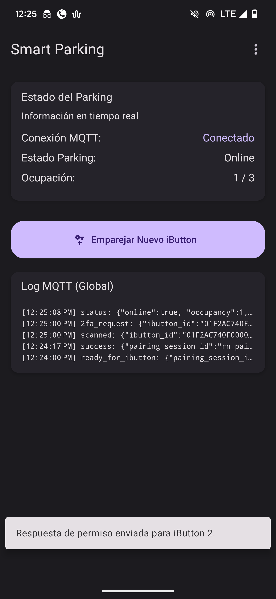
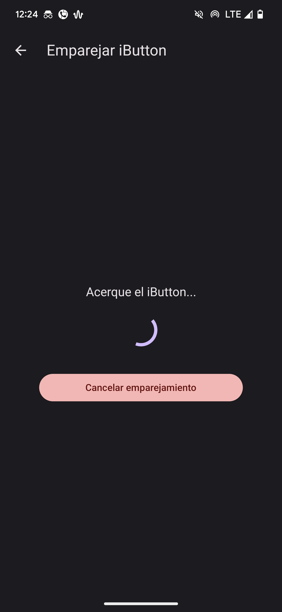
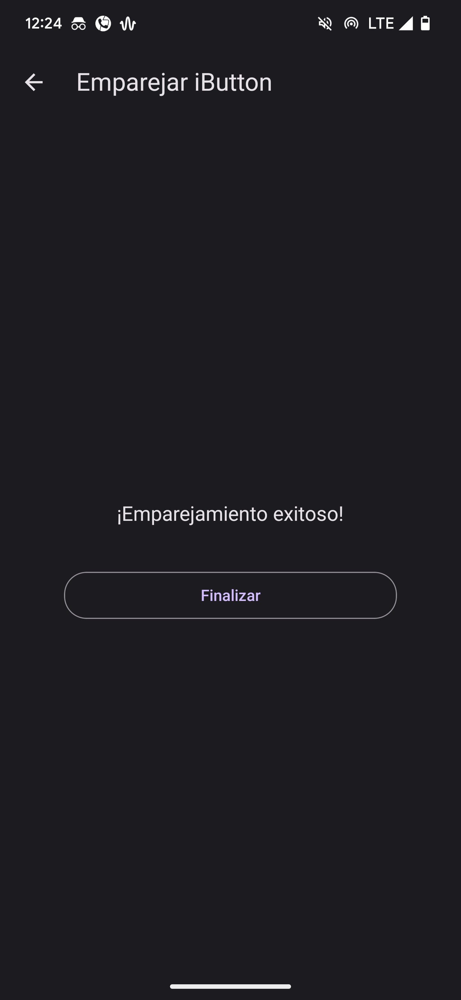
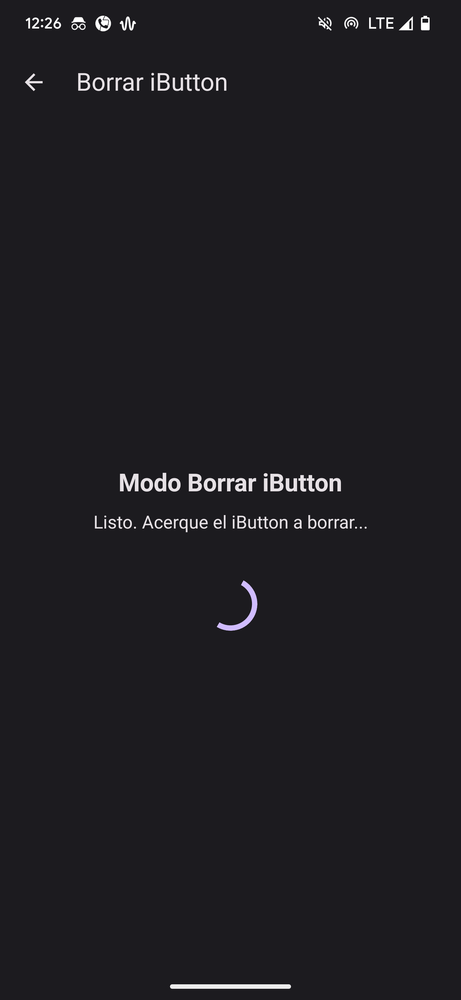
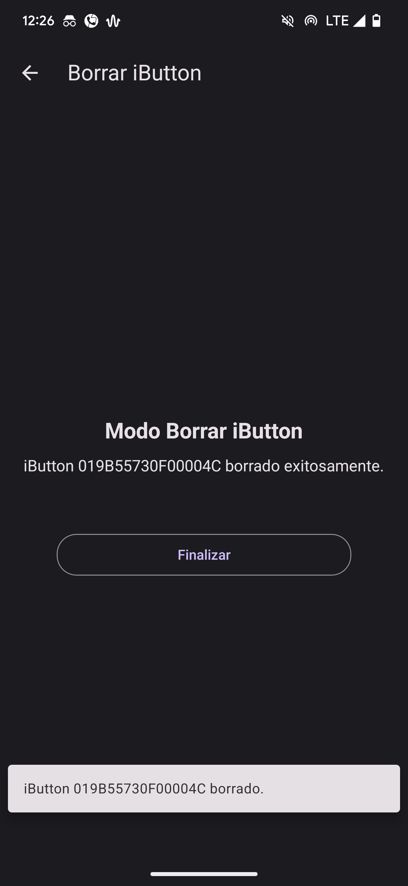

# Smart Parking MQTT Mobile App

A React Native - Expo mobile application that interfaces with the [Smart Parking ESP32 system](https://github.com/JuanLiz/smart-parking-esp32) via MQTT protocol. This app enables secure two-factor authentication, remote iButton management, and real-time parking status monitoring.

## Features

* **Two-Factor Authentication (2FA):** Approve or deny access requests when an iButton is scanned at the parking gate.
* **Biometric Security:** Uses device biometric authentication (fingerprint/face recognition) to verify user identity before approving entry requests.
* **Push Notifications:** Receive real-time notifications when an iButton is scanned, even when the app is in the background.
* **Remote iButton Management:**
  * Register new iButtons through a guided pairing process
  * Delete registered iButtons remotely
* **Real-time Parking Status:** Monitor current parking occupancy and system connection status.
* **MQTT Communication:** Connects to the same MQTT broker as the ESP32 device for reliable, real-time messaging.

## Setup & Installation

1. **Clone the Repository:**

   ```bash
   git clone https://github.com/JuanLiz/smart-parking-mqtt.git
   cd smart-parking-mqtt
   ```

2. **Install Dependencies:**

   ```bash
   npm install
   ```

3. **Configuration:**
   * The app connects to the MQTT broker at `ws://broker.emqx.io:8083/mqtt` by default.
   * To change the broker or topic prefix, modify the configuration in `services/MQTTService.ts`.

4. **Run the App in Expo Go:**

   ```bash
   npx expo start
   ```

   Or for a specific platform:

   ```bash
   npx expo run android
   npx expo run ios
   ```

## Usage

* **Home Screen:** Displays connection status and parking occupancy. Options to initiate iButton pairing or deletion.
* **Authentication Flow:** When an iButton is scanned at the parking gate, you'll receive a notification prompting you to approve/deny access.
* **Pairing Process:**
  1. Tap "Register New iButton" on the home screen
  2. Present the iButton to the reader when prompted
  3. Once detected, the app will confirm successful registration
* **Deletion Process:**
  1. Tap "Delete iButton" on the home screen
  2. Present the iButton to the reader when prompted
  3. Once detected, the app will confirm successful deletion

## App Screenshots

| Function | Screenshots |
|----------|-------------|
| Authentication Notifications |   |
| Authentication Flow |  |
| iButton Pairing |   |
| iButton Deletion |   |

## Integration with ESP32 System

This mobile app is designed to work specifically with the [Smart Parking ESP32 system](https://github.com/JuanLiz/smart-parking-esp32). Both systems connect to the same MQTT broker and communicate through a defined topic structure:

* `[PREFIX]/auth/2fa_request`: ESP32 requests authentication when an iButton is scanned
* `[PREFIX]/cmd/auth/2fa_response`: App responds with approval/denial
* `[PREFIX]/cmd/initiate_pairing`: App initiates pairing mode
* `[PREFIX]/pairing/success`: ESP32 confirms successful pairing
* `[PREFIX]/cmd/ibutton/initiate_delete_mode`: App initiates delete mode
* `[PREFIX]/status`: ESP32 publishes system status information

## License

This project is licensed under the MIT License. See the [LICENSE](./LICENSE) file for details.
